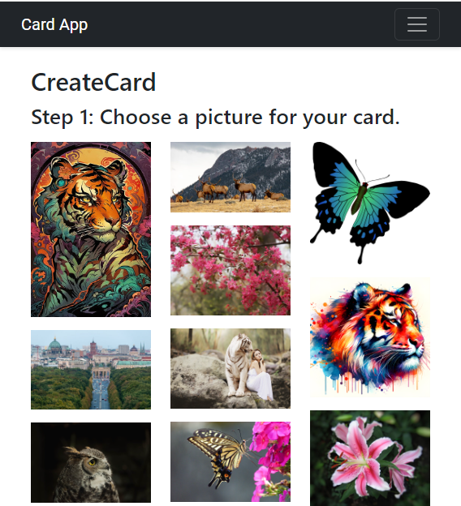
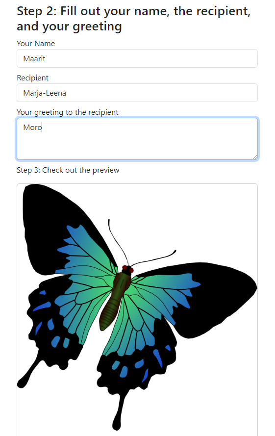

# Card App

Added Firestore. Currently you can add and remove cards. Also fixed the pictures.

In Create Card, you can click one of the images and scrollIntoView takes you to the form that you need to fill out in order to send the card

## Plan

- types/React-Router
- types/react-bootstrap
- types/bootstrap

Libraries

npm install --save @types/react-router-dom
npm i react-router-dom

npm install --save @types/react-bootstrap
npm i react-bootstrap

npm install --save @types/bootstrap
npm i bootstrap

[Tutorial](https://www.airplane.dev/blog/building-a-react-bootstrap-navbar-from-scratch)

[Stepper](https://m1.material.io/components/steppers.html#)

https://medium.com/sovtech-insights/how-to-generate-bootstrap-or-any-grids-dynamically-in-react-23df139199a8
